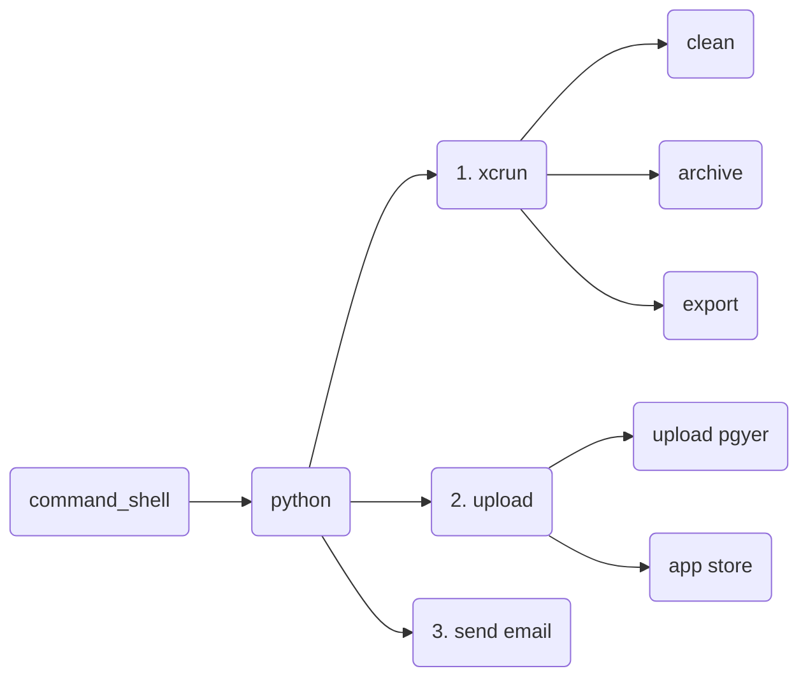

1. TOC
{:toc}


## 1. 整体执行流程图

1. shell 驱动python, python调用系统xcrun进行clean, archive, export ipa操作.  用shell驱动是为了简化py的执行步骤, 双击就可以执行相关的python文件
2. ipa制作完成后, 上传到蒲公英和APP Store, 脚本将会把上传位置作为可选项
3. 最后发送邮件进行通知




## 2. 分析

1. 脚本会将clear操作的代码注释掉, 需要的话可以自己放开, 因为每次clean后再次真机运行的时候会比较慢
2. 归档和导出的时候需要的参数, 在脚本头部进行配置
   1. 项目路径
   2. 工程名称
   3. 需要打包的scheme名称
   4. config 默认为Debug 此参数决定打release包还是debug包
   5. 所有生成的文件都将放在/Users/aikesi/Documents/scheme 下用时间命名的文件夹下: `/users/aikesi/documents/scheme/2023-06-29_18_10` 脚本会自动获取当前用户的Document目录
   6. 脚本会根据给定的参数自动计算相关路径,  上传完成后会打开最终文件存放的路径和先关网址


## 3. 注意事项

1. 蒲公英的快速上传已在脚本中完成, 具体流程和问题可以参照蒲公英官方文档

2. **ExportOptions.plist**  在导出的命令中需要用到这个参数, 参数来源有2种方式:

   1. 先用xcode打包一次, 并且导出, 在与xxx.ips同级的目录下会有ExportOptions.plist这个文件,  这个文件拿来用就可以, 放在某个你中意的目录下,  ==一定要在python脚本中修改这个文件的路径==
   2. 自己新建一个, 本次采用第一种获取方式
   3. **==plist文件中的method参数值可能影响导出包的大小==** 在第四章节的导出命令下会进行说明, `app-store`和`development` 导出包体积相差很大

3. **上传的应用商店账号的验证问题:**

   1. 以前是将开发者账号和密码填充在命令中就可以执行. 但现在不适用, 在开启二次验证的账号中需要使用新的鉴权方式.

   2. 新的鉴权方式:

      1. 用有开发者账号持有人的appleid登录appstore connect, 在 用户和访问 > 秘钥 > App Store Connect API 下新建秘钥并下载. 记录下Issuer ID, 如`239e06a4-1e91-4406-ab62-16760d87656d`. 在命令中要用. 记录下秘钥ID(`apiKey`)

      2. 在命令行中进入用户根目录, 并创建`.private_keys`文件夹, 将下载的.p8文件放在新建的文件夹下

         ```shell
         cd ~
         mkdir .private_keys
         # 最终.p8的路径应该是 /Users/aikesi/.private_keys/AuthKey_A89Y296X8K.p8
         ```

      3. 在命令中采用新的鉴权方式指定`apiIssuer`和`apiKey`,  系统会自己去刚才新建的文件夹下寻找.p8秘钥文件

         ```
         xcrun altool --upload-app -f {ipa_path} -t ios -u aikesi128@163.com --apiIssuer  239e06a4-1e91-4406-ab62-16760d87656d --apiKey  A89Y296X8K --verbose --show-progress;  echo $?
         ```

 4. 当前脚本如果放在git下管理, 可能在不同的电脑上, 如果git clone到不同的电脑上, 那么相关文件的路径不一致, ==这种情况可以用脚本来计算目标路径==

    ```python
    def check_file():
        global project_path
        # 检查项目路径
        if not os.path.exists(project_path):
            log_error('Please check project path')
        else:
            # 目标路径不存在, 开始计算项目路径
            res = os.popen("pwd")
            # 需要根据自己的脚本位置来调整目标路径, 切记
            project_path = res.read().replace("/script", "").strip()
    ```

    

## 4. 功能点代码

所有的功能点代码在脚本中都以独立的函数存在, 关于xcrun的功能都是用python在驱动shell执行,  如果为了方便测试, 可以将这些shell命令在命令行单独执行, 但是需要配置好相关参数或者在命令行进入相关正确目录.

1. 打包命令

   ```
   xcodebuild archive -archivePath {arc_p} -workspace {ws_p} -scheme {scheme_name} -configuration {config}
   # 说明
   arc_p: 生成打包的文件存放的完整路径包括后缀, 需要指定
   ws_p: 工程的完整路径
   scheme_name: 需要打包的scheme名称
   config: 打Release还是Debug
   ```

2. 导出命令

   ```shell
   xcodebuild -exportArchive -archivePath {arc_p} -exportPath {exp_p} -exportOptionsPlist {plist_path}
   # 说明
   arc_p: 打包完成的文件存放的完整路径包括后缀, 需要指定
   exp_p: 导出的文件存放的位置(文件夹)
   plist_path: 导出的时候需要指定exportOptionsPlist文件的全路径
   ```

   ```shell
   # 关于export命令中用到的exportOptionPlist种的参数说明
   Available keys for -exportOptionsPlist:
    
       compileBitcode : Bool
    
           For non-App Store exports, should Xcode re-compile the app from bitcode? Defaults to YES.
    
       embedOnDemandResourcesAssetPacksInBundle : Bool
    
           For non-App Store exports, if the app uses On Demand Resources and this is YES, asset packs are embedded in the app bundle so that the app can be tested without a server to host asset packs. Defaults to YES unless onDemandResourcesAssetPacksBaseURL is specified.
    
       iCloudContainerEnvironment
    
           For non-App Store exports, if the app is using CloudKit, this configures the "com.apple.developer.icloud-container-environment" entitlement. Available options: Development and Production. Defaults to Development.
    
       manifest : Dictionary
    
           For non-App Store exports, users can download your app over the web by opening your distribution manifest file in a web browser. To generate a distribution manifest, the value of this key should be a dictionary with three sub-keys: appURL, displayImageURL, fullSizeImageURL. The additional sub-key assetPackManifestURL is required when using on demand resources.
    
       method : String
    
           Describes how Xcode should export the archive. Available options: app-store, ad-hoc, package, enterprise, development, and developer-id. The list of options varies based on the type of archive. Defaults to development.
    
       onDemandResourcesAssetPacksBaseURL : String
    
           For non-App Store exports, if the app uses On Demand Resources and embedOnDemandResourcesAssetPacksInBundle isn't YES, this should be a base URL specifying where asset packs are going to be hosted. This configures the app to download asset packs from the specified URL.
       teamID : String
           The Developer Portal team to use for this export. Defaults to the team used to build the archive.
       thinning : String
           For non-App Store exports, should Xcode thin the package for one or more device variants? Available options: <none> (Xcode produces a non-thinned universal app), <thin-for-all-variants> (Xcode produces a universal app and all available thinned variants), or a model identifier for a specific device (e.g. "iPhone7,1"). Defaults to <none>.
       uploadBitcode : Bool
           For App Store exports, should the package include bitcode? Defaults to YES.
       uploadSymbols : Bool
           For App Store exports, should the package include symbols? Defaults to YES.
   
   https://blog.csdn.net/lrbtony/article/details/122882464
   ```

   

   

3. 上传到应用商店

   ```shell
   xcrun altool --upload-app -f {ipa_path} -t ios -u aikesi128@163.com --apiIssuer  239e06a4-1e91-4406-ab62-16760d87656d --apiKey  A89Y296X8K --verbose --show-progress;  echo $?
   # 说明
   ipa_path: 导出的ipa的全路径
   
   # 验证app
   xcrun altool --validate-app -f {ipa_path} -t ios -u aikesi128@163.com --apiIssuer  239e06a4-1e91-4406-ab62-16760d87656d --apiKey  A89Y296X8K --verbose --show-progress;  echo $?
   ```

   

## 5. 整体代码

### 1. 便捷的shell脚本

==文件后缀请设置为.commnad==

1. 将python脚本放在与shell脚本相同目录下, 双击shell脚本即可开始打包
2. 也可以不用shell脚本, 在命令行直接执行python脚本也可以

```shell
# !/bin/bash

cd `dirname $0`
pwd
echo "================================= Start Package ==================================="
python3 spider.py
```

### 2. 完整的python脚本

```python
# coding=utf-8

import requests
import webbrowser
import os
import subprocess
import time
import smtplib
from email.mime.text import MIMEText
from email.mime.multipart import MIMEMultipart
from email.header import Header


"""
1. 所有生成的文件都将放在user的Documents下的名为scheme的文件夹下
"""

# 请根据需求替换下方最重要的五个参数
project_path = "/Users/aikesi/Desktop/w/code/yhgs"  # 项目路径, 要打包的项目在哪里
workspace_name = "yhgs.xcworkspace"                 # 工程名称, 要打包哪个工程
scheme_name = "yhgs"                                # 要打包哪个scheme
config = "Debug"                                    # environment 打release还是debug
save_path = ''      # 程序自动计算, 不用管, 本次打包内容存放的路径

# debug 和 Release 使用不同的plist文件, 两种包打出来的体积相差还是较大的
plist_path_dev = os.path.join('/Users/aikesi/Desktop/cmd', 'ExportOptions_dev.plist')  # 之前打包成功的plist文件
plist_path_appstore = os.path.join('/Users/aikesi/Desktop/cmd', 'ExportOptions_appstore.plist')  # 之前打包成功的plist文件

# 蒲公英api信息:
API_KEY = "5302a529a2056d0bf688d0d2332f63e7"
USER_KEY = "ea99283e4bc1cd32908219a8a86fc7b8"
download_path = "https://www.pgyer.com/xiuzhifu_iOS"    # 蒲公英下载地址

# 发邮件信息
stmp_server = "smtp.qq.com"
authorization_code = "vyccfznymsgmbicc"
sender_address = "469087843@qq.com"
receiver_address_people = ["aikesi128@163.com", "ouyangshanshui@163.com", '13140449120@163.com']   # 收件人数组


def log(info):
    print("\n***************************** < %s > ******************************" % info.capitalize())


def log_error(error):
    print(f'\n*************** WARNING: {error.capitalize()} !!! ***************')


def send_email():
    log("Begin to send email...")
    server = smtplib.SMTP(stmp_server, 25)
    server.login(sender_address, authorization_code)

    multi = MIMEMultipart("mixd")
    multi["from"] = sender_address
    multi["to"] = receiver_address_people[0]

    if config == "Debug":
        multi["subject"] = Header("上传pgyer完成通知", "utf-8")
        html_text = """
            <p>应用已更新至蒲公英, 请更新您的应用程序</p>
            <a href = "%s">click to update</a>
        """ % download_path
    else:
        multi["subject"] = Header("上传appstore完成通知", "utf-8")
        html_text = '<p>应用已更新至TestFlight, 稍后收到Testflight推送后请下载最新版进行测试</p>'

    html = MIMEText(html_text, "html", "utf-8")
    # html["content-disposition"] = "attachment;"
    multi.attach(html)

    server.sendmail(sender_address, receiver_address_people, multi.as_string())
    server.quit()
    log("Email send success!")

    # open safari
    if config == "Debug":
        webbrowser.open_new(download_path)

    os.system(f'open {save_path}')


# 蒲公英上传参考地址: https://www.pgyer.com/doc/view/api#fastUploadApp
def upload_pgyer():
    log("Begin upload ipa file to pgyer")
    start = time.time()
    ipa_path = f'{os.path.join(save_path,"export")}/{scheme_name}.ipa'
    url = 'https://www.pgyer.com/apiv2/app/getCOSToken'     # 新版快速上传
    data = {
        'uKey': USER_KEY,
        '_api_key': API_KEY,
        'buildType': 'ipa',
        'oversea': 2,
        'installType': '1',
        'updateDescription': "this is test script for iOS"
    }

    # 获取上传地址
    r = requests.post(url, data=data)
    if r.status_code == 200:

        # 获取arguments成功, 准备上传文件
        obj = r.json()
        endpoint = obj['data']['endpoint']
        key = obj['data']['key']
        params = obj['data']['params']
        body = {"key": key,
                "signature": params['signature'],
                "x-cos-security-token": params['x-cos-security-token'],
                }
        files = {"file": open(ipa_path, "rb")}
        resp = requests.post(endpoint, data=body, files=files)
        if resp.status_code == 204:
            log("Upload pyger success, take %0.1f second" % (time.time() - start))
        else:
            log('upload pyger fail')
            exit(-1)
    else:
        log("Upload failed, take %0.1f second" % (time.time() - start))
        exit(-1)


def upload_appstore():
    ipa_path = f'{os.path.join(save_path, "export")}/{scheme_name}.ipa'
    command = f'xcrun altool --upload-app -f {ipa_path} -t ios -u aikesi128@163.com ' \
              '--apiIssuer  239e06a4-1e91-4406-ab62-16760d87656d --apiKey  A89Y296X8K' \
              '--verbose --show-progress; echo $?'
    log("Begin upload ipa to app store")
    log(command)
    start = time.time()
    res = subprocess.Popen(command, shell=True)
    res.wait()

    end = time.time()
    if res.returncode == 0:
        log("upload appstore success, take %.1f seconds" % (end - start))
    else:
        log("upload appstore failed, take %.1f seconds" % (end - start))
        exit(-1)


def export():
    log("Begin export ipa")

    if not os.path.exists(plist_path_dev):
        log_error('please check exportOptionPlist file path')
        exit(0)

    if not os.path.exists(plist_path_appstore):
        log_error('please check exportOptionPlist file path')
        exit(0)

    plist_path = ''
    if config == "Debug":
        plist_path = plist_path_dev
    else:
        plist_path = plist_path_appstore

    start = time.time()
    arc_p = os.path.join(save_path, f'{scheme_name}.xcarchive')
    exp_p = os.path.join(save_path, 'export')
    command = f"xcodebuild -exportArchive -archivePath {arc_p} -exportPath {exp_p} -exportOptionsPlist {plist_path}"
    log(command)
    res = subprocess.Popen(command, shell=True)
    res.wait()
    end = time.time()
    if res.returncode == 0:
        log("export success, take %.1f seconds" % (end - start))
    else:
        log("export failed, take %.1f seconds" % (end - start))
        exit(-1)

    # 暂时先不删除archive后的文件
    # command = "rm -rf %s" % archive_path
    # res = subprocess.Popen(command, shell=True)
    # res.wait()
    # if res.returncode == 0:
    #     log("archive file has been deleted")
    # else:
    #     log("archive file delete fail")


def archive():
    log("begin archive")
    start = time.time()
    arc_p = os.path.join(save_path, f'{scheme_name}.xcarchive')
    ws_p = os.path.join(project_path, workspace_name)  # 工程全路径
    command = f"xcodebuild archive -archivePath {arc_p} -workspace {ws_p} -scheme {scheme_name} -configuration {config}"
    log(command)
    res = subprocess.Popen(command, shell=True)
    res.wait()
    end = time.time()
    if res.returncode == 0:
        log("archive success, take %.1f seconds" % (end - start))
    else:
        log("archive failed, take %.1f seconds" % (end - start))
        exit(-1)


def clear():
    log("Begin clear")
    start = time.time()
    workspace_p = os.path.join(project_path, workspace_name)    # 工程全路径
    command = f"xcodebuild clean -workspace {workspace_p} -scheme {scheme_name}"
    res = subprocess.Popen(command, shell=True)
    res.wait()
    end = time.time()
    if res.returncode == 0:
        log("clean success, take %0.1f seconds" % (end - start))
    else:
        log("clean failed, take %0.1f seconds" % (end - start))


def check_file():
    # 检查项目路径
    if not os.path.exists(project_path):
        log_error('Please check project path')
        return

    # 检查workspace
    if not os.path.exists(os.path.join(project_path, workspace_name)):
        log_error('Please check workspace path')
        return

    # 检查user documents目录下有没有名为scheme的文件夹
    doc_path = os.popen('cd ~/Documents; pwd').read().strip()
    des_root_path = os.path.join(doc_path, scheme_name)  # ~/Documents/scheme
    if not os.path.exists(des_root_path):
        os.mkdir(des_root_path)  # 创建根文件夹

    global save_path

    # 文件夹名称
    dir_name = time.strftime('%Y-%m-%d_%H_%M')
    save_path = os.path.join(des_root_path, dir_name)   # ~/Documents/scheme/2023-01-01_12_12_23
    if not os.path.exists(save_path):
        os.mkdir(save_path)  # 创建本次存放文件的文件夹

    log(f'root path is {save_path}')
    log('Finish check')


def choose_upload_location():
    global config
    print('请选择上传目标: 1. 蒲公英  2.app store\n')
    des = input()

    while not isinstance(des.isdecimal(), int):
        print('请选择上传目标: 1. 蒲公英  2.app store\n')
        des = input()

    if int(des) != 1 and int(des) != 2:
        exit('非法输入, 程序终止!!!')

    if int(des) == 1:
        config = "Debug"
    else:
        config = 'Release'


if __name__ == "__main__":

    start_time = time.time()

    check_file()
    # clear() # 不用clear 会导致下一次真机运行编译比较慢
    choose_upload_location()
    archive()
    export()

    if config == "Release":
        upload_appstore()
    else:
        upload_pgyer()

    send_email()
    # webbrowser.open_new(download_path)

    end_time = time.time()
    log("python script execute finished, take %.1f seconds" % (end_time - start_time))

```


## 6. 参考文档

https://www.jianshu.com/p/abb202dd3522

https://juejin.cn/post/6844903714432499719

https://www.jianshu.com/p/061a03829c5f

https://www.cnblogs.com/sundaysme/articles/11696902.html

[使用 altool 上传并公证 App 的二进制文件](https://help.apple.com/asc/appsaltool/#/apdSb30def73)

https://developer.apple.com/help/app-store-connect/manage-builds/upload-builds
